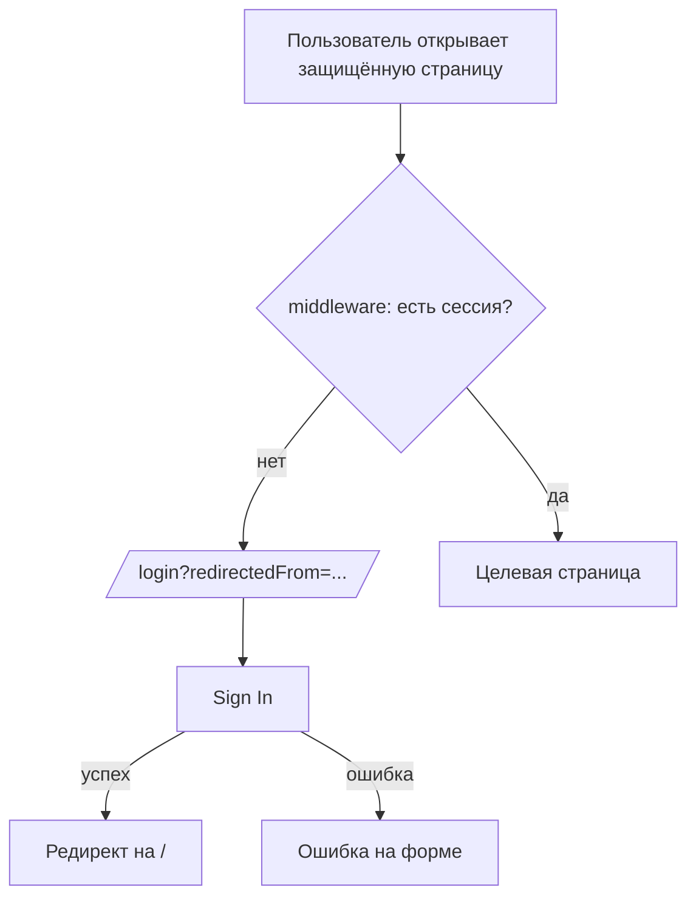

## UX/UI и User Flow аудит (Scrimspec Dashboard / HWAR)

### Область аудита
- **Приложение**: `apps/dashboard` (Next.js App Router)
- **Ключевые разделы**: Auth (`/login`, `/signup`), Pipeline (`/ingest`, `/analysis`), HWAR (`/hwar/*`)
- **Метод**: анализ информационной архитектуры (IA), критических сценариев, состояний UI (loading/empty/error), а также базовых эвристик и доступности (a11y).

---

### 1) Карта входов и навигации (IA)

**Основные entry points**
- **Pipeline**: `/` (Home) → быстрый вход в `/ingest` и `/analysis`
- **HWAR Hub**: `/hwar` → вход в три ветки: Create / Factory / Library

**Фактическая проблема навигации**
- Глобальный сайдбар в `apps/dashboard/src/app/layout.tsx` ведёт в **Ingest / Analysis / Video Factory**, но **не даёт явного входа** в:
  - `/hwar` (hub),
  - `/hwar/create` (создание проектов),
  - `/hwar/library` (пресеты/персонажи),
  - плюс “Settings” в сайдбаре не навигационный (кнопка без `href`).

**Риск**
- Пользователь (особенно новый) не строит у себя корректную ментальную модель продукта: “Factory есть, а Create/Library как будто нет”.

---

### 2) User flows (сквозные сценарии)

#### 2.1 Авторизация (Login / Signup → вход в продукт)



**Критичный разрыв**: параметр `redirectedFrom` добавляется middleware, но login-страница/логика не использует его для возврата пользователя на исходный маршрут (вместо этого всегда `router.push('/')`).

#### 2.2 Pipeline: Ingest → Analysis → Просмотр результата

```mermaid
flowchart TD
  A[/ingest: New Harvest/] --> B[Очередь ingest/enrich]
  B --> C[/analysis: список видео/статусов/выбор/Analyze/]
  C --> D[/analysis/[id]: AES breakdown + beats + tags/]
```

**Замечания по UX**
- Состояния загрузки/ошибок частично есть, но местами ошибки “съедаются” (см. список проблем ниже).
- В таблице `/analysis` клики по строке переключают либо выбор, либо навигацию — это мощно, но требует очень аккуратного UX (предсказуемость + доступность клавиатуры).

#### 2.3 HWAR Create: проект → сценарии → keyframes → клипы → финал

```mermaid
flowchart TD
  A[/hwar/create: Projects/] --> B[/hwar/create/new: Wizard 1-2-3/]
  B --> C[/hwar/create/[project_id]?tab=script/]
  C --> D[Generate Keyframes]
  D --> E[/tab=keyframes: first/last + Generate Clip/]
  E --> F[/tab=mission: мониторинг/]
  E --> G[/tab=final: видео по сценам/]
```

**Важно**: в текущем коде кнопка генерации клипов (MiniMax) уже есть (на `tab=keyframes`), и отображение результата есть (на `tab=final`, `video` при `job.status === 'succeeded'`).

---

### 3) UX/UI аудит по ключевым эвристикам

#### 3.1 Навигация и “ориентация в системе”
- **Проблема**: отсутствуют глобальные ссылки на `/hwar` (hub), `/hwar/create`, `/hwar/library` — пользователь теряет основной продуктовый сценарий.
- **Проблема**: разный “каркас” по разделам — Pipeline живёт в одном сайдбаре, а Factory/Library имеют собственные сайдбары, но глобально это не склеено в единый UX.

#### 3.2 Состояния: loading / empty / error
- **Проблема (критично)**: `CreateIndex` (`/hwar/create`) в queryFn делает `catch` и возвращает `[]`. В результате **ошибка загрузки проектов маскируется под “No projects yet”**, что разрушает доверие и делает диагностику невозможной.
- **Проблема**: частично используются “пустые” fallback-тексты “No data / Error loading” вместо объяснения “что сделать дальше” и/или корректного retry.

#### 3.3 Копирайт, локаль, консистентность языка
- UI в основном **на английском** (включая `<html lang="en">`), при этом проект и документация у вас русскоязычные.
- Есть жёсткие локали вида `toLocaleString('en-US')` — это ломает RU-форматы чисел/дат.

#### 3.4 Предсказуемость действий и предотвращение ошибок
- `/analysis`: строка таблицы одновременно служит и “селектором”, и “переходом в детали”, в зависимости от `isAnalyzed`. Пользователь может не понимать, почему клик иногда “выбирает”, а иногда “открывает”.
- `/hwar/create/new`: есть fallback `title || "Untitled Project"` — это скрывает проблему ввода вместо того, чтобы валидировать форму.

#### 3.5 Доступность (a11y) — минимальный набор
- Иконк-кнопки (edit/delete и т.п.) местами без явных `aria-label`.
- В `/analysis` превьюшки имеют `alt=""` — плохо для скринридеров (нужно либо осмысленное `alt`, либо явно декоративное с `aria-hidden`/`role` стратегией).
- Кликабельные карточки/строки таблиц без явного keyboard UX (Enter/Space), что критично для управляемости без мыши.

---

### 4) Приоритизированный backlog улучшений (P0 / P1 / P2)

#### P0 (ломает user flow / доверие / поддержку)
- **Вернуть пользователя после логина туда, откуда пришёл**: учитывать `redirectedFrom` на `/login` (и на `/signup` при необходимости).
- **Не маскировать ошибки под пустые состояния**:
  - `/hwar/create` (queryFn возвращает `[]` при ошибке) → показывать error state + retry.
- **Склеить навигацию**: добавить явный вход в `/hwar` и в ветки `/hwar/create`, `/hwar/library` из глобального UI (или через единый “Hub/Products” раздел).

#### P1 (значимо улучшает эффективность и снижает когнитивную нагрузку)
- **Единая стратегия локали/языка**:
  - убрать жёсткий `lang="en"`,
  - убрать `toLocaleString('en-US')`,
  - унифицировать копирайт (RU или i18n).
- **Уточнить UX таблицы `/analysis`**:
  - развести “выбор” и “переход” (например, явная кнопка “Open result” + чекбокс только для выбора).
- **Формы: “без silent fallback”**:
  - обязательные поля (title/prompt) — валидировать и показывать причину блокировки, а не создавать “Untitled Project”.

#### P2 (качество и масштабирование)
- **A11y-проход**: aria-label для icon-only кнопок, keyboard-навигация для кликабельных карточек/строк, согласованные фокусы.
- **Единый паттерн Empty/Error**: расширить `EmptyState` (варианты для error/retry) или выделить `ErrorState`.
- **Стабилизировать `ModelSelector`**: сейчас выбор default вызывает `onChange` прямо в рендере (побочный эффект) — лучше перевести на `useEffect`, чтобы убрать риск лишних ререндеров и нестабильности.

---

### 5) Конкретные точки в коде (для быстрых исправлений)
- **Глобальная навигация**: `apps/dashboard/src/app/layout.tsx`
- **Login redirect**: `apps/dashboard/src/app/login/page.tsx` + `apps/dashboard/src/shared/providers/auth-provider.tsx` + `apps/dashboard/src/middleware.ts`
- **Ошибки маскируются под empty**: `apps/dashboard/src/app/hwar/create/page.tsx`
- **Локаль/язык/форматы**: `apps/dashboard/src/app/**/page.tsx` (особенно `toLocaleString('en-US')`)
- **Model selector side effect**: `apps/dashboard/src/shared/components/ai/ModelSelector.tsx`


